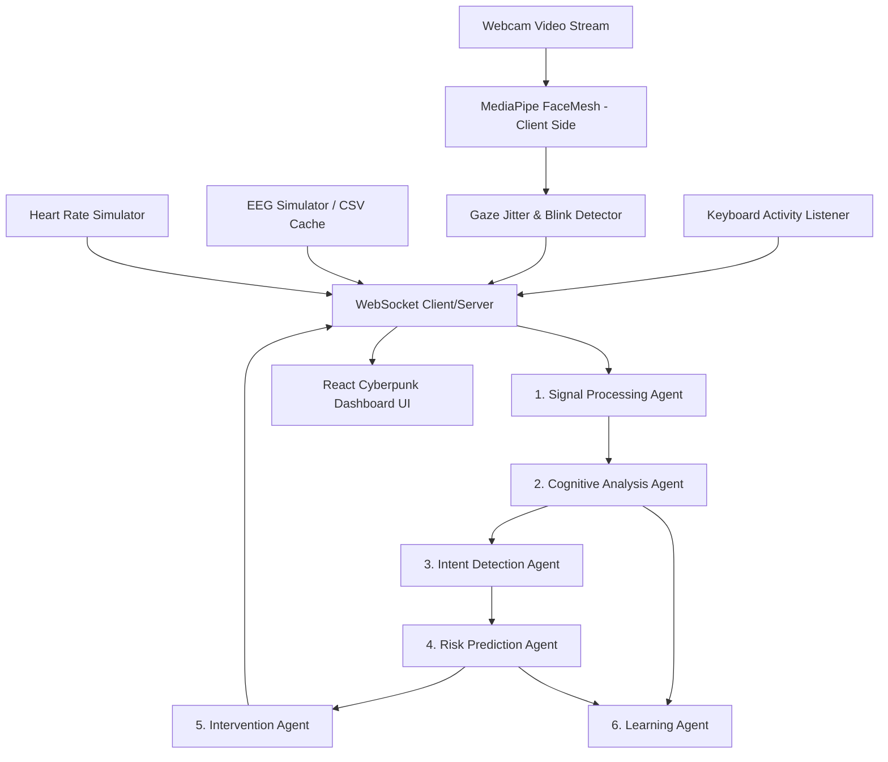

# NeuroPilot Guardian 🧠✈️

NeuroPilot Guardian is a hackathon-ready **Brain-Computer Interface (BCI) and Human-Computer Interaction (HCI) Cognitive Safety Platform**. 

Instead of acting as a simple brain-controlled switch, the platform monitors an operator's real-time cognitive state (Attention, Fatigue, Stress, and Cognitive Load) and predicts when performance degradation, distraction, or dangerous operational mistakes are likely to occur. It is designed for high-risk applications like railways, aviation, healthcare, industrial operations, and accessibility.

---

## 🚀 Key Features

* **Multi-Modal Input Stream**:
  * **Real Web Camera Input**: Tracks eye blink rate (for fatigue) and pupil coordinates (to measure gaze jitter & distraction).
  * **Real Keyboard Activity**: Computes real-time typing frequency directly from browser keydowns.
  * **EEG Signals (Pre-trained Model + Simulation)**: Feeds real multi-channel EEG vectors from the MUSE dataset into a classifier.
  * **Heart Rate & HRV (Simulation)**: Tracks simulated beats-per-minute (BPM) and Heart Rate Variability (HRV).
* **6-Agent Cognitive Orchestrator**:
  1. **Signal Processing Agent**: Cleans inputs and computes running averages to smooth telemetry.
  2. **Cognitive Analysis Agent**: Processes multi-modal parameters to calculate Attention, Fatigue, Stress, and Load indices.
  3. **Intent Detection Agent**: Translates keyboard inputs and motor imagery EEG commands into workflows (e.g. Study Mode).
  4. **Risk Prediction Agent**: Models operator crash probability and safety levels (Safe, Warning, Critical).
  5. **Intervention Agent**: Issues visual notifications, sounds, and active environment adjustments.
  6. **Learning Agent**: Automatically recalibrates the operator's resting heart rate and blink rate baselines.
* **Futuristic Cyberpunk Dashboard**: Gorgeous dark HUD styled with Tailwind CSS, showing status gauges, real-time area charts, and an interactive **Agent Reasoning Log** terminal displaying step-by-step agent decisions.

---

## 🛠️ Architecture Diagram



---

## 📥 Getting Started (Quick Setup)

### 1. Prerequisites
Ensure you have **Node.js** (v18+) and **Python** (v3.10+) installed.

### 2. Backend Installation & Run
1. Navigate to the backend directory:
   ```bash
   cd backend
   ```
2. Create and activate a Python virtual environment:
   ```bash
   python -m venv .venv
   # On Windows (PowerShell):
   .\.venv\Scripts\Activate.ps1
   # On macOS/Linux:
   source .venv/bin/activate
   ```
3. Install dependencies:
   ```bash
   pip install -r requirements.txt
   ```
4. Start the server:
   ```bash
   python run.py
   ```
The backend server runs on `http://127.0.0.1:8000`.

### 3. Frontend Installation & Run
1. Navigate to the frontend directory:
   ```bash
   cd frontend
   ```
2. Install dependencies:
   ```bash
   npm install
   ```
3. Start the Vite development server:
   ```bash
   npm run dev
   ```
The frontend is available at `http://localhost:5173`. Open it in your browser and allow camera permissions!

---

## 🎬 Live Demo Scenarios

Open the dashboard and use the **Demo Control Console** to test the safety system:

1. **Scenario 1: Normal Operator State (nominals)**:
   * Select **Scenario 1** in the console.
   * Gaze and blink rates are normal.
   * Status shows **Green (Safe)** with High Attention and Low Fatigue.
2. **Scenario 2: Drowsiness & Fatigue (risk triggers)**:
   * Select **Scenario 2** in the console, or simply **close your eyes** in front of the webcam for more than 2.5 seconds, or look down.
   * Fatigue score will spike, triggering a **Critical Alert** banner, flashing the screen red, sounding audio warnings, and recommending an immediate operator break.
3. **Scenario 3: Intent & Focus (workflow automation)**:
   * Select **Scenario 3** in the console, or trigger typing activity while in focus.
   * The dashboard transitions to **Study Mode** (initiating a 25-minute Pomodoro timer, launching resource links, and enabling focus mode visuals).
