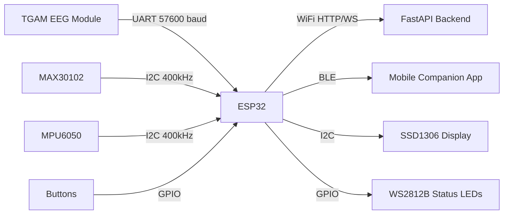

# NeuroPilot Guardian — Hardware Design Document

## ESP32-Based Cognitive Safety Sensor Shield

This document describes the hardware architecture for the NeuroPilot Guardian's physical sensor board, designed as a compact wearable shield that connects to the backend via WiFi/BLE.

---

## Bill of Materials (BOM)

| # | Component | Part Number | Qty | Purpose |
|---|-----------|-------------|-----|---------|
| 1 | ESP32-WROOM-32D | ESP32-DevKitC | 1 | Main MCU with WiFi/BLE |
| 2 | MAX30102 | SEN-MAX30102 | 1 | Pulse Oximeter & Heart Rate Sensor |
| 3 | MPU6050 | GY-521 | 1 | 6-Axis Accelerometer + Gyroscope (Head Pose) |
| 4 | NeuroSky TGAM | TGAM1 Module | 1 | Single-channel EEG acquisition |
| 5 | OLED Display | SSD1306 128x64 | 1 | Local status display (optional) |
| 6 | Push Button | Tactile 6mm | 2 | Mode select / Reset |
| 7 | LED (RGB) | WS2812B | 3 | Visual status indicators (Safe/Warn/Critical) |
| 8 | LiPo Battery | 3.7V 1000mAh | 1 | Portable power supply |
| 9 | TP4056 | TP4056 Module | 1 | LiPo charge controller |
| 10 | Voltage Regulator | AMS1117-3.3 | 1 | 3.3V regulation for ESP32 |
| 11 | Capacitors | 100nF, 10µF | 4 | Decoupling / Filtering |
| 12 | Resistors | 4.7kΩ, 10kΩ | 4 | I2C pull-ups, voltage dividers |

---

## Circuit Schematic

```
                          ┌─────────────────────────────────┐
                          │         ESP32-WROOM-32D         │
                          │                                 │
    ┌──────────┐          │  GPIO21 (SDA) ◄──────────┐      │
    │ MAX30102 │──SDA─────┤                          │      │
    │ (Heart   │──SCL─────┤  GPIO22 (SCL) ◄──────┐   │      │
    │  Rate)   │──INT─────┤  GPIO4  (INT)        │   │      │
    │          │──VCC─────┤  3.3V                │   │      │
    │          │──GND─────┤  GND                 │   │      │
    └──────────┘          │                      │   │      │
                          │              4.7kΩ   │   │      │
    ┌──────────┐          │          ┌──┤├──3.3V  │   │      │
    │ MPU6050  │──SDA─────┤  GPIO21 ─┘           │   │      │
    │ (IMU /   │──SCL─────┤  GPIO22 ─┘  4.7kΩ    │   │      │
    │ Head     │──INT─────┤  GPIO2              ┌─┘   │      │
    │ Pose)    │──VCC─────┤  3.3V               │     │      │
    │          │──GND─────┤  GND                │     │      │
    └──────────┘          │                     │     │      │
                          │      I2C Bus ───────┘     │      │
    ┌──────────┐          │                           │      │
    │ TGAM     │──TX──────┤  GPIO16 (RX2)             │      │
    │ (EEG     │──VCC─────┤  3.3V                     │      │
    │ Module)  │──GND─────┤  GND                      │      │
    └──────────┘          │                           │      │
                          │                           │      │
    ┌──────────┐          │                           │      │
    │ SSD1306  │──SDA─────┤  GPIO21 (shared I2C) ─────┘      │
    │ OLED     │──SCL─────┤  GPIO22 (shared I2C)              │
    │ 128x64   │──VCC─────┤  3.3V                            │
    │          │──GND─────┤  GND                             │
    └──────────┘          │                                  │
                          │                                  │
    ┌──────────┐          │                                  │
    │ WS2812B  │──DIN─────┤  GPIO5  (NeoPixel Data)          │
    │ x3 LEDs  │──VCC─────┤  5V (USB VBUS)                   │
    │ (Status) │──GND─────┤  GND                             │
    └──────────┘          │                                  │
                          │                                  │
    ┌──────────┐          │                                  │
    │ Buttons  │──BTN1────┤  GPIO14 (Mode Select)            │
    │          │──BTN2────┤  GPIO12 (Reset/Calibrate)        │
    └──────────┘          │                                  │
                          │                                  │
    ┌──────────┐          │                                  │
    │ TP4056   │──OUT+────┤  VIN (via AMS1117)               │
    │ + LiPo   │──OUT-────┤  GND                             │
    │ 3.7V     │──USB─────┤  (Micro-USB charging)            │
    └──────────┘          │                                  │
                          └──────────────────────────────────┘
```

---

## I2C Address Map

| Device | I2C Address | Bus |
|--------|-------------|-----|
| MAX30102 | 0x57 | I2C0 (GPIO21/22) |
| MPU6050 | 0x68 | I2C0 (GPIO21/22) |
| SSD1306 OLED | 0x3C | I2C0 (GPIO21/22) |

---

## Pin Assignment Table

| GPIO | Function | Connected To |
|------|----------|-------------|
| GPIO2 | Input (INT) | MPU6050 Interrupt |
| GPIO4 | Input (INT) | MAX30102 Interrupt |
| GPIO5 | Output (Data) | WS2812B NeoPixel Chain |
| GPIO12 | Input (Pull-up) | Reset/Calibrate Button |
| GPIO14 | Input (Pull-up) | Mode Select Button |
| GPIO16 | UART RX2 | TGAM EEG TX |
| GPIO21 | I2C SDA | Shared Bus (MAX30102, MPU6050, OLED) |
| GPIO22 | I2C SCL | Shared Bus (MAX30102, MPU6050, OLED) |

---

## PCB Layout Guidelines

```
    ┌─────────────────────────────────────────────────────┐
    │                   TOP LAYER                          │
    │                                                      │
    │   ┌─────────┐           ┌─────────────────────┐     │
    │   │ TP4056  │           │    ESP32-WROOM-32D   │     │
    │   │ Charger │           │                      │     │
    │   └─────────┘           │    ┌──────────────┐  │     │
    │                         │    │  Antenna      │  │     │
    │   ┌─────────┐           │    │  Keep-Out     │  │     │
    │   │ AMS1117 │           │    │  Zone (No Cu) │  │     │
    │   │  3.3V   │           │    └──────────────┘  │     │
    │   └─────────┘           └─────────────────────┘     │
    │                                                      │
    │   ┌────────┐  ┌────────┐  ┌────────┐  ┌────────┐   │
    │   │MAX30102│  │MPU6050 │  │SSD1306 │  │  TGAM  │   │
    │   │(Heart) │  │ (IMU)  │  │ (OLED) │  │ (EEG)  │   │
    │   └────────┘  └────────┘  └────────┘  └────────┘   │
    │                                                      │
    │   [BTN1]  [BTN2]     [LED1] [LED2] [LED3]           │
    │                      (GRN)  (YEL)  (RED)            │
    │                                                      │
    │   ┌──────────────────────────────────────────┐      │
    │   │          LiPo Battery Pad                 │      │
    │   │          3.7V 1000mAh                     │      │
    │   └──────────────────────────────────────────┘      │
    │                                                      │
    │              Board Size: 70mm x 50mm                 │
    │              2-Layer PCB, 1.6mm FR4                   │
    └─────────────────────────────────────────────────────┘
```

### Design Rules
- **Trace width**: 0.3mm (signal), 0.5mm (power)
- **Via size**: 0.4mm drill, 0.8mm pad
- **Clearance**: 0.2mm minimum
- **Ground plane**: Full bottom-layer pour connected to all GND pins
- **Antenna keep-out**: No copper fill within 10mm of ESP32 antenna area

---

## Data Flow: Hardware → Backend



---

## ESP32 Firmware Packet Format

The ESP32 sends JSON telemetry packets over WebSocket to the backend at 10Hz:

```json
{
  "device_id": "NPSG-001",
  "timestamp": 1718394000,
  "eeg": {
    "attention": 72,
    "meditation": 55,
    "raw_value": 128,
    "signal_quality": 0
  },
  "heart_rate": {
    "bpm": 74,
    "spo2": 98,
    "ir_value": 50000
  },
  "imu": {
    "accel": { "x": 0.02, "y": -0.05, "z": 9.81 },
    "gyro": { "x": 1.2, "y": -0.8, "z": 0.3 },
    "pitch": 5.2,
    "yaw": -3.1,
    "roll": 0.8
  },
  "button_state": 0
}
```

---

## Assembly Notes

1. **Solder ESP32 first** — align and reflow the castellated pads
2. **I2C bus** — ensure 4.7kΩ pull-ups are placed close to the ESP32 SDA/SCL pins
3. **MAX30102** — mount on the bottom of the board so the sensor window faces the skin when worn on the wrist/forehead band
4. **TGAM EEG** — connect via header pins for easy removal; requires dry electrode contact on the forehead (FP1 position)
5. **Antenna** — maintain copper keep-out zone; do not route traces under the ESP32 antenna area
6. **Battery** — use JST-PH 2.0mm connector for LiPo; ensure TP4056 is accessible for USB-C charging
